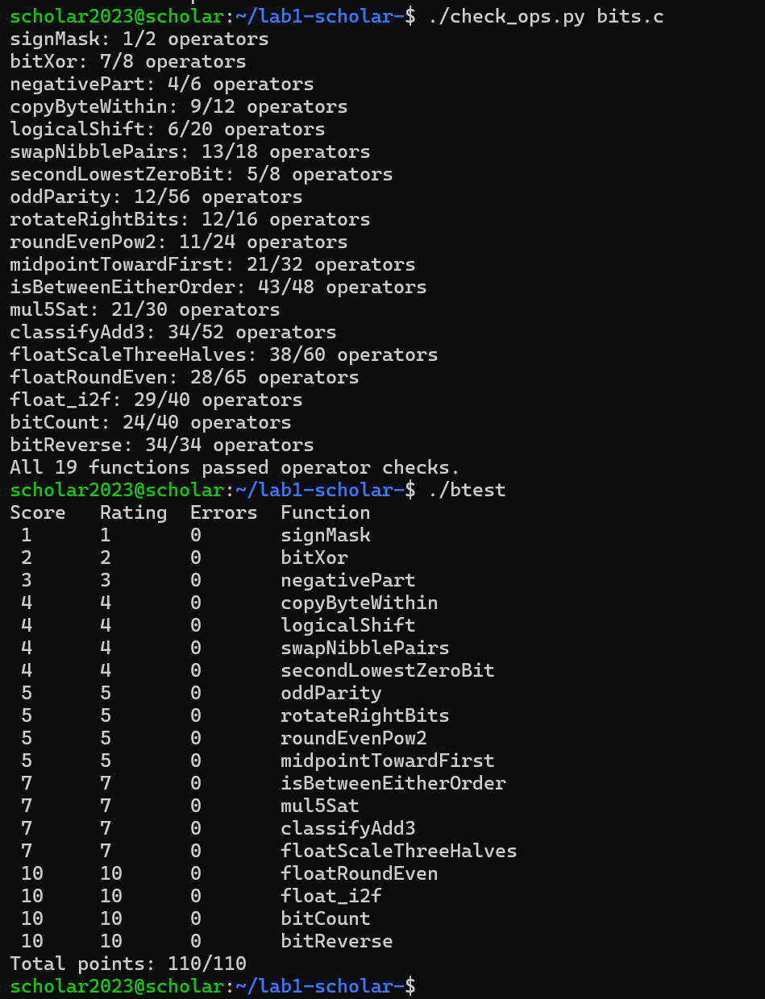

Lab1: 实验报告

测试截图

P1：利用左移运算生成最高位为 1、其余位为 0 的掩码。这道题比较简单，主要是熟悉基础操作。

P2：根据德摩根定律，将异或操作转换为仅使用非和与的表达式。虽然原理简单，但想尽量精简操作数还是花了一点时间。

P3：提取符号位并结合取反加一实现条件取反。这道题让我更清楚地理解了补码的表示方式。

P4：构造源字节掩码和目标清零掩码，提取源字节移位后与清理过目标位置的数相或。做的时候要特别注意字节的索引顺序。

P5：算术右移会补符号位，这是做整数部分时碰到的第一个麻烦。必须在右移后构造掩码清除高位多余的 1，还要专门处理边界情况，否则测试会报错。

P6：利用掩码提取高低半字节，移位后进行拼装。虽然思路直接，但亲手推导掩码让我对十六进制有了更直观的认识。

P7：通过巧妙转换将最低的 0 位置 1，再计算寻找下一个 0 位。这道题的位运算技巧比较强，在草稿纸上推演了很久才找到规律。

P8：采用折叠异或法，将高低位不断异或压缩，最后取最低位的奇偶性。中间因为忘了处理算术右移补 1 的问题，导致结果错误，排查了一段时间才发现。

P9：通过左右移位组合实现循环移位，需用掩码处理移位零位的边界情况。这道题让我把之前模糊的移位和溢出关系彻底弄清楚了。

P10：利用加法偏移量实现向偶数舍入。需要准确判断舍入的方向，处理进位时出现了几次错误，后来画图理顺了逻辑。

P11：这是整数部分非常折磨人的题目。虽然利用安全公式避免了直接相加溢出，但怎么根据符号和奇偶修正取整方向依然很难。一开始我尝试直接用减法判断方向，结果测试时在 INT_MAX 和 INT_MIN 边界上会因溢出导致判断翻转。后来查阅了资料，并借助AI梳理了安全减法逻辑，改用符号位结合幅度判断才过关。

P12：通过安全减法比较大小，确定最小值和最大值，最终判断目标值是否在区间内。同样在边界值相减溢出时卡壳了，查阅了相关溢出判断的资料才解决。

P13：计算乘 5 后的结果，通过符号位翻转和幅度大小判断溢出，利用掩码构造饱和值。最开始用符号位检测完全失效，看了AI的解释才明白乘法溢出后结果可能正好绕回正数范围，最后改用了高位阈值判断。

P14：分步计算两数之和与三数之和的符号位和溢出情况，分类处理正溢出、负溢出或正常。这道题的分类讨论非常繁琐，各种极限边界组合让人头疼，通过对每一步溢出的严密推导才写出代码。

P15：提取浮点数的各个部分，处理非规格化数，计算乘 1.5 的值并进行向偶数舍入及进位。浮点数乘法的进位和舍入让我在这里卡了很久，中途修改了无数次，最后通过AI辅助理解了非规格化数的处理逻辑才顺利通过。

P16：根据阶码定位小数部分的截断位置，根据丢弃位的大小和保留位的奇偶性进行向偶数舍入。在极小值的边界上反复失败，后来查AI帮忙梳理了偶数舍入的判断条件才得以完善。

P17：提取符号和绝对值，计算最高有效位索引，对尾数进行舍入及进位处理，最后拼装浮点数格式。整数转浮点数的思路比较清晰，但在处理进位导致阶码增加的边界上险些超限。

P18：采用分治法（SWAR 算法）统计二进制中 1 的个数，通过掩码逐层合并计数。一开始完全想不到这个思路，查阅了资料了解 SWAR 算法后，再自己推导掩码才实现。

P19：采用分治法反转位，依次交换各位组，最后交换高低 16 位。逻辑与统计 1 的个数相似，但必须警惕算术右移补 1 的问题，通过对掩码的精准控制，最终在操作数限制内实现。

//P10-19基本都是看的ai